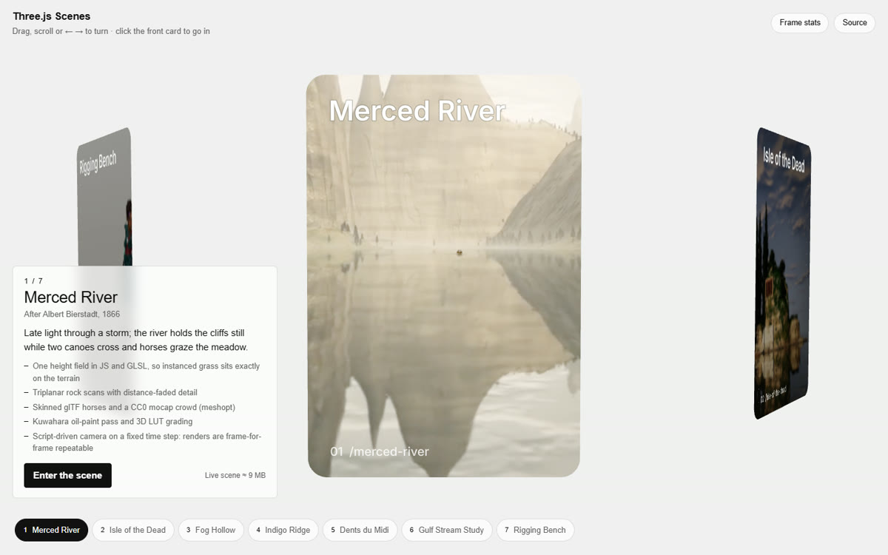

# Three.js Scenes

**Live: https://nasht12.github.io/threejs-portfolio/**

A ring of portal cards built with **React Three Fiber**, after pmndrs' *enter portals* example. Each card is a window
into a real-time Three.js scene: turn the ring to bring one to the front, watch it move, then dive through the
portal into the live scene.



| Scene | What it shows |
|---|---|
| Merced River (after Bierstadt) | one height field in JS and GLSL; triplanar rock scans; skinned glTF horses and a mocap crowd; Kuwahara oil-paint pass; script-driven, frame-repeatable camera |
| Isle of the Dead (after Böcklin) | procedural cliffs with bedding ledges; instanced cypresses and grass; walkable island |
| Fog Hollow | depth-weighted fog scattering and crepuscular rays; first-person walk |
| Indigo Ridge | a character lofted onto a skeleton in code; camera-following grass; live wind and lighting |
| Dents du Midi (after Courbet) | per-frame cloud-shadow texture; oil-paint and natural looks |
| Gulf Stream Study (after Homer) | one wave formula on the CPU and GPU, so props ride the surface they're drawn on |
| Rigging Bench | drop in any humanoid; automatic bone mapping and mocap retargeting; glTF-Transform compression (7.2 → 1.9 MB) |

## The ring itself

- **Stack:** React 19, React Three Fiber 9, drei 10, three r186, Zustand 5, Vite 8, TypeScript 7, Vitest, Playwright.
- **Renders on demand.** With `frameloop="demand"` the GPU only works while something moves: the ring, a playing preview, a state change. A visitor reading a caption costs nothing.
- **One real portal.** A `MeshPortalMaterial` renders its world into three screen-sized targets every frame, so only the front card is a true portal. The others fake the same window by cropping their poster to what the portal would show from that angle, so cards keep their depth as they swing round, and the swap at the front doesn't jump. The ring scales to any number of cards.
- **Holds a frame budget.** A monitor measures active frame times (idle gaps excluded) and drops to a light tier when the median passes 22 ms. That tier has DPR 1 and no video. The tier is chosen silently: small machines, slow or metered connections (Network Information API) and a slow first load start light. `?quality=low` pins it for demos, and **Frame stats** shows draw calls, triangles, GPU resources and frame time live.
- **Cleans up after itself.** A preview video exists only while its card is at the front: its decoder and texture are disposed when the card turns away. The ring's WebGL context is released while a scene is open, so only one context exists at a time.
- **Keyboard and screen reader first.** The list of works mirrors the ring (arrow keys turn it, Enter on the front card goes in). A live region announces where you are, focus moves into and back out of scenes, and `prefers-reduced-motion` is respected. An axe scan in CI holds it at zero WCAG A/AA violations.
- **One store.** Selection, mode, quality tier and an interaction event log live in a single Zustand store. The URL (`#/work/…`, `#/scene/…`) follows it, so deep links and the Back button work.

## Run it

```bash
npm install
npm run dev        # http://localhost:5173/threejs-portfolio/
npm test           # unit tests
npm run test:e2e   # end-to-end tests: production build, headless Chrome, CPU WebGL
```

## How it was built

This repo was built with Claude Code as the implementation agent, working from the conventions in
[`CLAUDE.md`](CLAUDE.md): render-loop rules, disposal, performance tiers, accessibility requirements and a definition
of done. The tests are the done-conditions, and CI runs the same checks before every deploy. Every description of a
scene was checked against that scene's code.

## Credits

Rock and ground textures: [Poly Haven](https://polyhaven.com) (CC0). Motion capture (baked into the scenes): Universal
Animation Library by Quaternius (CC0). Paintings referenced: Albert Bierstadt, Arnold Böcklin, Gustave Courbet, Winslow Homer.
